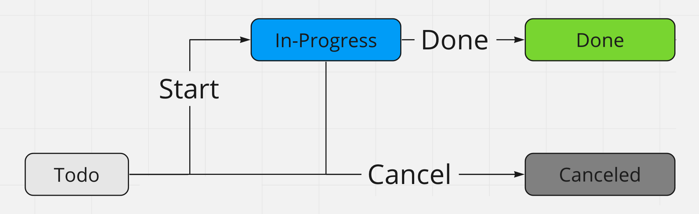
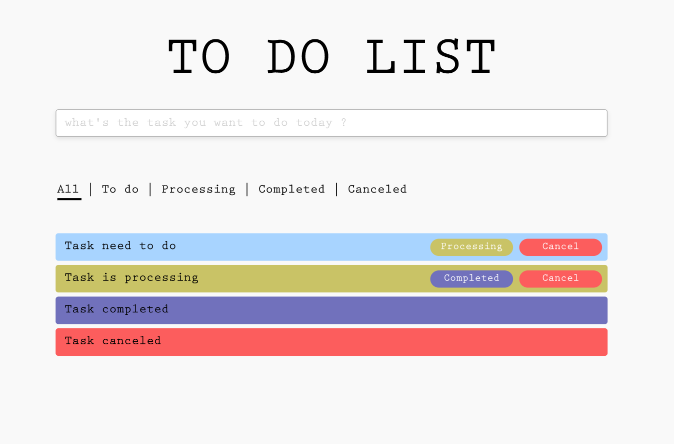

# Coding Test

Todo List web application

### Requirements
#### #1

- Handle Task's status as described in the screenshot bellow. Building RESTful APIs using Node.JS and MongoDB to stored data.

- Only valid actions are displayed on the task. For example: when the task is `todo`, there should only be `Processing` and `Cancel` buttons. When the task is `progress`, there should only be `Complete` or `Cancel` buttons.

